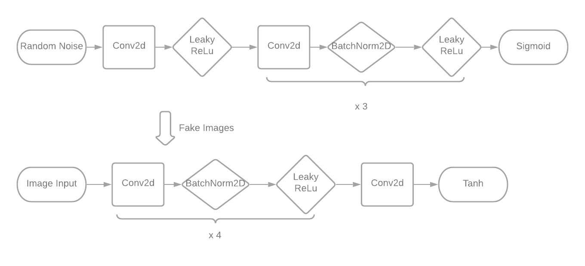
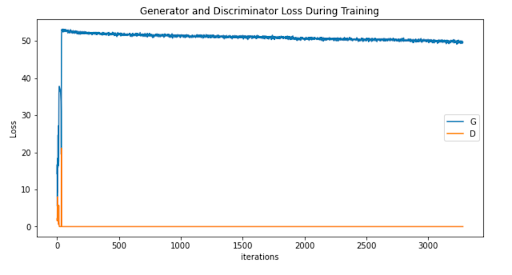
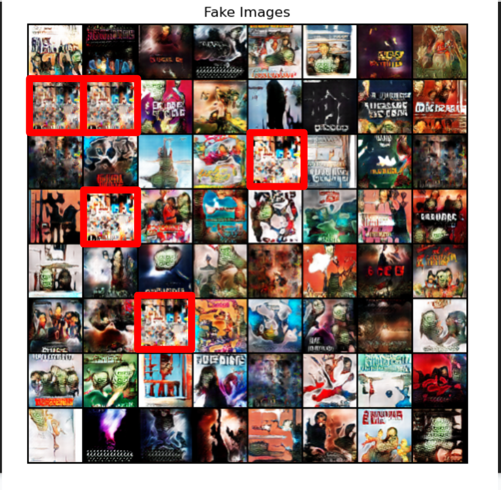
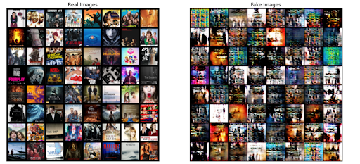
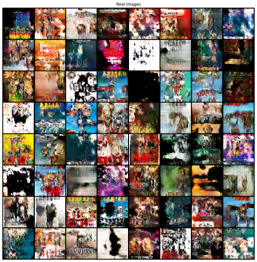
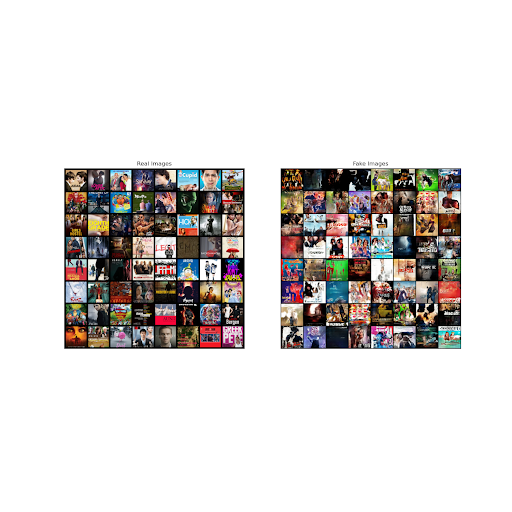

## Poster Generator
Chloe, David, Nate, Carson, and Pei Pei

### Presentation Video available [here](https://youtu.be/nxF-Zohz0dg)

## Abstract
In this project, we trained a Pytorch Deep Convolutional Generative Adversarial Network to generate movie poster images, based on a Kaggle training dataset. We experimented with image sizes, cropping, and genre specifications to generate different types of output. In this paper, we detail our methods, and discuss our results and ethical questions surrounding our work. Overall, we were satisfied with our results, but felt that increasing image resolution is a worthy line of further work.

## Introduction
The goal of this project is to generate movie poster images from random noise that are as close to human created posters as possible. 

This problem is difficult to solve because movie posters tend to have very distinct and recognizable elements as compared to other kinds of images. Firstly, because movie posters are designed specifically to market the movie they depict to an audience, they tend to have many intentional and minute details which a model would struggle to learn. Secondly, movie posters tend to have cohesive designs which highlight several different important objects. In comparison, most other images tend to highlight a specific subject with less attention given to other details. So, aside from the subject, the rest of the image is closer to random noise, something that is easier for a model to learn compared to that of a movie poster. Recent generative art has struggled with emphasizing clearly recognizable elements, instead focusing on emulating stylistic aspects of different genres.

## Methods: 
We used Pytorch to create a Deep Convolutional Generative Adversarial Network. This network takes poster image inputs from our Kaggle poster dataset of 41,000 images. Each input is a three-channel poster image of 3x64x64 pixels (inputs are resized and center cropped to fit this size). We feed random noise of size 100x1x1 to the generator, which will then output an image of size 3x64x64, which is the same size as the input images. We then concatenate the generated output with real poster images, and then begin the training loop. In each training loop, we first pass a batch of 128 images through the discriminator and update its weights. Once we have trained the discriminator, we then train and update the weights of the generator. While training, we used Adam as the optimizer function and binary cross entropy as our loss function. We trained the generator and discriminator simultaneously, adjusting learning rates and loss functions until we are satisfied with the results. In the 64x64 generator, we trained the generator and discriminator 1:1.  We ran our model with a variety of different numbers of epochs, beginning with 5, then 10, then 20, then a few hundred, and eventually 10,000 epochs. 

Additionally, we plan to visualize our model output in order to evaluate its performance. After training, we will look at an array of images and judge their diversity, quality, and the prevalence of any distinct patterns or shapes. We also save the outputs of the model at multiple steps throughout the training process to create a way of understanding how our model learns.

We took the discriminator and generator architectures from PyTorch’s DCGAN tutorial. The discriminator architecture contains 5 Conv2d layers, each followed by one BatchNorm2d layer and one  in place LeakyReLU (with the exception of the first Conv2d layer, which is followed by only LeakyReLU, and the last Conv2d is followed by a Sigmoid function). Each Conv2d layer has a kernel size (4x4), a stride of 2, and a padding of 1, except for the last layer, which has stride 1 and padding 0. 
The generator architecture consists of 5 ConvTranspose2d layers, each followed by one BatchNorm2d layer and one ReLU layer (with the exception of the last ConvTranspose2d layer, which is followed by a Tanh layer). Each ConvTranspose2d layer uses a kernel size of 4x4, a stride of 2, and a padding of 1, with the exception of the first layer, which uses a stride of 1 and a padding of 0.

We experimented with the discriminator and generator architectures only when we attempted to modify the size of the input, by adding additional convolutional layers. We decided not to modify the architecture because it is the standard DCGAN architecture, as described in the paper which first introduced DCGANS ([Unsupervised Representation Learning with Deep Convolutional Generative Adversarial Networks](https://arxiv.org/pdf/1511.06434.pdf)).

## Discussion:
The project’s final product is a model that can present different sets of generated poster images, including images generated based on the entire data. It can also generate a random poster given random noise input.

The nature of the data and the project goals necessitates a subjective evaluation of the final products; there is no commonly used objective evaluation function for GANs. As a result, the evaluation must purely depend on the viewer’s comparison between the real images and the generated artworks. We performed a qualitative check of images for mode collapse. Loss plots were used predominantly to ensure neither network was training much more quickly than the other. 

However, one of the initial problems that we ran into was a failure to converge, in which the generator and discriminator fail to find an equilibrium. In our case, the discriminator overpowered the generator. This is due to the discriminator training too fast in comparison to the generator, and being able to predict real and fake images near perfectly, and the generator providing fake images that were too easily identifiable. Over multiple epochs, this would continue due to a lack of useful information from the discriminator and the generator would be unable to progress. However, this was eventually fixed by adding update skips to slow down the discriminator training rate, as well as training for more epochs so the network could recover.

Compared to other similar projects, our image quality is lower resolution, as our current images are 128 x 128 pixels. However, the diversity of images trained is much greater, as the data set is incredibly comprehensive across a variety of different styles and genres of movie posters. In increasing our output image size from 64x64 to 128x128, we encountered difficulties with either the generator or the discriminator training too quickly and thus failing to converge, much like in the image above. It also presents additional difficulty in balancing the complexity of the discriminator and generator architectures.

In providing a side by side comparison of our generated posters and the original posters that we trained on, we hope to show how images created by neural nets approach realism but still struggle with noticeable visual specificity. Our generated images are approximating the depiction of text and faces, but are still generally illegible or unrecognizable. 

(above: 128x128 image at 300 epochs)

Many of our output images also featured the same specific patterns. This is evidence of mode collapse, in which the generator finds a specific pattern which consistently tricks the discriminator. This hinders the diversity of images which can be generated, and fails to push the generator into creating more realistic images for the sake of tricking the discriminator. We noticed over many epochs, mode collapse appears and then resolves in cycles, as the generator is able to trick the discriminator for a bit before the discriminator recognizes the pattern as being fake.

## Ethics: 
One of the largest ethical dilemmas with using a GAN to create art is whether or not the GAN itself is the artist. What defines an artist? Is the AI itself the creator of the art, are the creators of the GAN the artists, or even the artists in the training set? By the Visual Artists Rights Act of 1990, this would follow the idea of “human authorship” and the creators of the GAN code would be accredited as the artists, since VARA accepts that artists inject their own personality and ingenuity into their creations. And yet, it’s equally arguable that the results of training and learning are unable to be predicted, and subsequently can create final images far beyond the creators’ predictions; as a result, this creates a wholly novel experience of uniquely created art, and so, the true artist is the AI. 

In addition, projects like ours raise more questions into whether or not the generated works can be attributed to the network itself, and how. We have to consider how training the images on the data set too closely can result in arguable plagiarism, and whether this burden lies on the creators of the network. How can the accreditation of the original artists be reconciled with the creation of GAN art based on their works?

Furthermore, using a network to generate art is something not yet covered thoroughly by current copyright law. It exists in a grey area in current law, and therefore any harmful actions by generative AI doesn’t have clearly defined repercussions. Should current copyright law be extended to AI art? If so, it’s possible for new, creative artworks to be mass-produced and would directly harm smaller creators that are unable to keep up with the rate of production. On the other hand, it’s also commonly argued that AI art cannot be deemed as truly “creative” and therefore has no creative author to accredit, as it fails to generate innovative works and only mimics previously created works. The obvious follow-up question is how “creativity” is defined, and how human creativity will be changed by the introduction of AI creativity. 

However, there still may be ethical space for AI in art. In “Modeling Artistic Workflows for Image Generation and Editing”, the authors of the paper propose a model that generates images in a given art style at different stages in the creative process. The model can generate possible directions for an artist to go given a sketch, or even offer polishing touches on nearly completed work. The existence of such a model suggests that maybe AI can serve as a source of inspiration for human artists. Doing so would avoid the pitfalls of copying work from others and allow people to create art of their own. Like many other issues in tech, the ethicality of using AI for generative art relies on how it is used. Nearly any model can be used for malicious purposes, so we must rely on regulation and awareness to minimize the harm it can do.

## Reflection:
We were satisfied with the results of our GAN. Overall, the large dataset (41,000 images) resulted in outputted content that displayed the general aesthetics and colors of movie posters. The “text” in the generated content was particularly interesting, as it seemed to have a sense of font and style despite containing no recognizable letters. We are still currently unable to increase the number of pixels in the generated output from 64x64 to 256x256, making the generated images still quite pixelated. This is a clear area of the project that could be expanded upon further. Because training with more pixels takes longer, we could solve this problem by running the 64x64 images through a network that adds resolution to the generated images.

In the future, we would like to explore different sub-genres of posters. We briefly experimented with generating horror posters, which had a more uniform aesthetics than all genres combined. We could further explore horror posters, in addition to other genres like action. Additionally, most posters generated included faces. One additional step for this project would be to add more training data with faces in order to generate faces with more detail. Overall, this project was an informative exercise in creating a GAN, and left us with some fun (and maybe a little eerie) generated posters.

## Related Works

["Generative Adversarial Networks (GANs): Challenges, Solutions, and Further Directions"](https://dl.acm.org/doi/10.1145/3446374) provides a broad and systematic overview of GANs and their development over time. It begins with a description of what GANs are; namely, two neural networks (a generator and a discriminator) which “compete” with each other by minimizing their own loss and maximizing the other’s until they reach a Nash equilibrium. In training GANs, three major issues arise: mode collapse, non-convergence, and instability. Mode collapse refers to when a generator only outputs samples with limited diversity, which occurs because the small subset of images consistently tricks the discriminator. Non-convergence occurs when the generator and discriminator oscillate during training, rather than converging at an equilibrium as desired. And finally, instability occurs when one of the neural networks becomes more powerful than the other. The more powerful then fails to provide gradients to the less powerful NN, causing learning to come to a standstill. The article pinpoints and explores solutions to several different causes for these issues such as inappropriate architectures, hyperparameters, loss functions, and optimization algorithms.

["A survey of image synthesis and editing with generative adversarial networks"](https://ieeexplore.ieee.org/abstract/document/8195348) summarizes the different uses of General Adversarial Networks. GANs consist of a generator network which creates images and a discriminator network that determines if the image can be considered real or fake. They can be used to modify an existing image or create new images from a text input. Although basic GANs can create realistic images it is still difficult to generate high resolution images as well as video and 3D models.

In ["CAN: Creative Adversarial Networks Generating “Art” by Learning About Styles and Deviating from Style Norms"](https://arxiv.org/abs/1706.07068), researchers build upon GANs to create what they call a Creative Adversarial Networks (CANs). This paper points out that the nature of a GAN is to produce art that is indiscriminable from the art the discriminator has access to, and thus it is not creative. In order to make it “creative,” this paper proposes a model in which the discriminator portion of the network gives two types of feedback to the generator: whether or not the discriminator thinks the work is art, and a classification of the genre of art the work belongs to. The goal of the CAN is to generate images that the discriminator thinks is art, but that cannot be easily classified into a specific art genre. This causes the outputs to push the boundaries of genre a little (but not too far), and thus be “creative.”

In ["Visual Indeterminacy in GAN Art"](https://direct.mit.edu/leon/article/53/4/424/96926/Visual-Indeterminacy-in-GAN-Art), the author tackles the topic of visual indeterminacy in GAN art - the quality of images to appear real, but upon looking closer, are actually composed of elements that are unrecognizable. Many artworks generated by GAN models have details that can look real, such as human arms or tall skyscrapers, yet these details are not resolved fully and blend ambiguously into the background or into other objects. The author believes that this indeterminacy stems from imperfect generative models, as GANs at the moment are only capable of combining objects, textures, and backgrounds in an "uncanny valley" manner; models are not yet able to generate new compositions of these elements, and as a result, must rely on training images with similar, existing compositions. Subsequently, the resulting images are almost realistic, but fail to achieve certainty. Moving forward, the paper suggests conducting more research into vision neuroscience models and cortical modeling to better understand how visual indeterminacy can be manipulated in GAN artworks.

In ["Modeling Artistic Workflows for Image Generation and Editing"](https://www.ecva.net/papers/eccv_2020/papers_ECCV/papers/123630154.pdf), the authors of the paper propose a model that generates images in a given art style and image early in the artist's creation process with the intention of producing a completed image in the correct style and revamping the process of creating art. In order to achieve this the authors design a new optimization process with learning based regularization that prevents the model from overfitting and deconstructing the original art style but allows for the model to create new and unique images. This project was completed for Adobe Inc, so the authors had access to numerous images and image drafts, however they minimized variance by restricting their images in their dataset to chairs, anime drawings, and faces.

